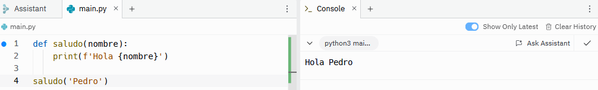
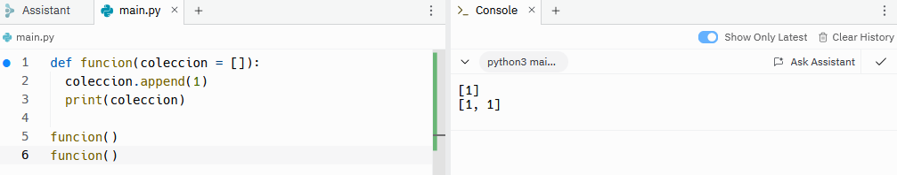
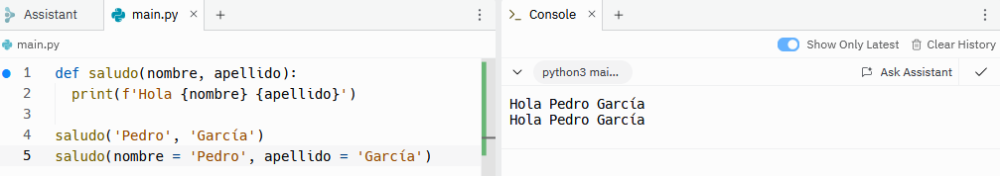

# Argumentos

Los argumentos son una parte fundamental de las funciones. Son los valores conocidos que se introducen en una función para que esta realice una tarea. La forma de declarar una función es la siguiente:
```sh
def saludo(nombre):
    print(f'Hola {nombre}')

saludo('Pedro')
```


El argumento es lo que va entre paréntesis cuando se declara la función, en este caso es ```nombre```. Cuando quiero llamar a la función se utiliza el nombre de la función y, entre paréntesis, el nombre que se quiera utilizar, en este caso 'Pedro'.

Sin embargo, no siempre es necesario determinar un argumento, sino que se pueden utilizar argumentos por defecto. De esta forma, si llamo a la función pero no le doy un valor, tendrá un valor por defecto. Para ello, a la hora de declarar la función entre paréntesis nombraremos el argumento y pondremos ```= 'valor por defecto'```. Veamos un ejemplo:
```sh
def saludo(nombre = 'Invitado'):
    print(f'Hola {nombre}')

saludo('Pedro')
saludo()
```


Se puede observar que si le digo que el nombre es Pedro entonces utiliza ese valor, mientras que si no le doy ningún valor, utiliza 'Invitado', que es el valor por defecto. 

Se pueden utilizar argumentos por defecto de todo tipo, sin embargo, se considera una mala práctica utilizar las listas como valor por defecto por su característica mutable. 
```sh
def funcion(coleccion = []):
  coleccion.append(1)
  print(coleccion)

funcion()
funcion()
```


Como se puede observar, al utilizar listas acumulará los cambios en la lista.

En principio, los argumentos son de posición, es decir, si en una función escribo ```(nombre, apellido)``` a la hora de llamar la función tendré que poner ('Pedro', 'García'), ya que el sistema entiende que el orden en el que se declama la función es el que se va a utilizar a la hora de llamar a la función. Sin embargo, se pueden asignar nombres a los argumentos de forma que ya no sean argumentos de posición, sino argumentos que dependen del nombre. 
```sh
def saludo(nombre, apellido):
    print(f'Hola {nombre} {apellido}')

saludo('Pedro', 'García')
saludo(nombre = 'Pedro', apellido = 'García')
```


El resultado es el mismo en ambos casos, pero si se utilizan nombres para cada argumento, al llamar la función, se podría poner ```saludo(apellido = 'García', nombre = 'Pedro')```. Es recomendable nombrar los argumentos cuando hay más de dos argumentos. 

Cuando se van a utilizar muchos argumentos y no se sabe el número de ellos, se pueden englobar dentro de un solo argumento, que por defecto se llama ```args``` y que se escribe detras de un asterisco (*).
```sh
def saludo(app, *args):
  print(f"Hola {' '.join(args)}, bienvenido a {app}")

saludo('YouTube', 'Pedro', 'García')
```


Finalmente, hay otro tipo de argumentos que son los que tienen una palabra clave y un valor asociado, como los diccionarios. En este caso, se escribe ```**kwargs```, con 2 asteriscos.
```sh
def saludo(**kwargs):
  print(f"Hola {kwargs['nombre']} {kwargs['apellido']}")

saludo(nombre = 'Pedro', apellido = 'García')
```


