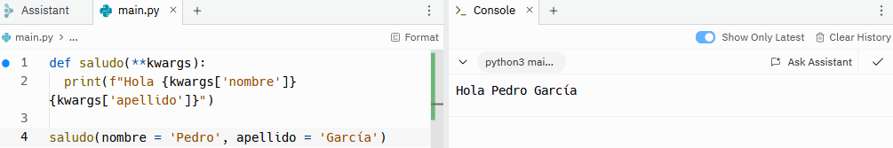

# Declaraciones condicionales
Las declaraciones condicionales permiten ejecutar el código si se cumplen una serie de requisitos o condiciones. Este tipo de declaraciones permiten realizar un programa dinámico y que tome decisiones en función de la situación. La forma en la que se escribe una declaración condicional es mediante la palabra clave ```if```, y hay que prestar especial atención a la sangría, ya que, de lo contrario, daría lugar a errores. Empezaremos con un ejemplo sencillo:
```sh
edad = 40

if edad > 18:
    print('Puedes conducir')
```
Como se observa en el ejemplo, la forma de escribir una declaración condicional es escribiendo ```if``` seguido de la condición y ```:```. En la siguiente línea, antes de escribir el resultado que queremos que nos devuelva, es necesario dejar 4 espacios (sangría). 
El resultado del código anterior es el siguiente:


Como la edad es de 40 años, el resultado es 'Puedes votar'. 
Si la edad fuera 16, no da ningún resultado porque no hay ninguna ninguna orden que recoja la condición edad < 16.
```sh
edad = 16

if edad > 18:
    print('Puedes conducir')
```


Para ello hay otras palabras clave que son ```elif``` y ```else```. ```elif``` permite añadir más de una condición, es decir, si la primera condición no se cumple pasa a comprobar si la segunda se cumple. Mientras que ```else``` incluye todas las situaciones que no se incluyan en las condiciones anteriores. 
```sh
edad = 40

if edad < 18:
    print('No puedes conducir')
elif edad > 90:
    print('No puedes conducir')
else:
    print('Puedes conducir')
```
En este caso, siendo la edad es 40, el resultado será 'Puedes conducir', mientras que si la edad es 16 o 92, por ejemplo, el resultado será 'No puedes conducir'.


## Operadores condicionales
Además de los operadores utilizados hasta ahora, que son > y <, hay otros 5. A continuación se muestra una lista completa con todos los operadores que se pueden utilizar en las declaraciones condicionales.
- Igualdad: ==
- Mayor que: >
- Mayor o igual que: >=
- Menor que: <
- Menor o igual que: <=
- Diferencia: !=
- Diferencia: <>

La última forma de expresar diferencia no se utiliza, de hecho, está obsoleta. 

Por otro lado, hasta ahora hemos utilizado las condicionales con números. A continuación, veremos algunos ejemplos que combinan los diferentes operadores con diferentes estructuras de datos.

### Cadenas:
```sh
usuario = 'Pedro'

if usuario == 'Pedro':
    print('Bienvenido')
else:
    print('No estás autorizado')
```


### Números:
```sh
edad = 18

if edad >= 18:
    print('Puedes votar')
else:
    print('No puedes votar')
```


### Listas o tuplas:
```sh
lista_uno = ['Pedro', 'Juan']
lista_dos = ['María', 'Carmen']

if lista_uno != lista_dos:
    print('No coinciden')
else:
    print('Coinciden')
```


### Operador in
Además de los operadores vistos hasta ahora, existe otro operador, ```in```, que se utiliza para buscar elementos dentro de estructuras de datos. En este caso utilizaremos una cadena.
```sh
frase = 'El perro de Roque juega en el campo'
palabra = 'campo'

if palabra in frase:
    print(f'{palabra} se encuentra en la frase')
else:
    print(f'{palabra} no se encuentra en la frase')
```
Tratamos de buscar la palabra 'campo' en la frase y, como coincide, obtenemos 'campo se encuentra en la frase'.


## Operador ternario
Existe otra forma de escribir las declaraciones condicionales que se recomienda utilizar en el caso de declaraciones sencillas. Este operador ternario permite escribir la condición en una sola línea de código, por lo que permite ahorrar líneas de código. El código siguiente:
```sh
usuario = 'Pedro'

if usuario == 'Pedro':
    print('Bienvenido')
else:
    print('No estás autorizado')
```


Dará el mismo resultado escrito de la siguiente forma:
```sh
print('Bienvenido') if usuario == 'Pedro' else print('No estás autorizado')
```


## Condicionales compuestas
Hasta ahora hemos visto condicionales simples con la siguiente estructura: si se cumple 'condición 1' --> 'resultado 1', si se cumple 'condición 2' --> 'resultado 2' y, si no se cumple ningúna de las anteriores --> 'resultado 3'. Sin embargo, le podemos decir al programa que si se cumplen 'condición 1' y 'condición 2' queremos 'resultado 1'. Es decir, las condicionales compuestas contienen varias condiciones en una sola línea de código. En estas condicionales se utilizan 3 tipos de operadores, que son ```and```, ```or``` y ```and not```. 
Para los siguientes ejemplos vamos a simular que estamos creando un sistema de inicio de sesión en una aplicación. En estos casos solo se permite el acceso a la cuenta cuando el email y la contraseña son correctos, por lo que utilizaremos el operador ```and```.
```sh
email = 'paco@gmail.com'
contraseña = 'paco123'

if email == 'paco@gmail.com' and contraseña == 'paco123':
    print('Acceso autorizado')
else:
    print('Acceso no autorizado')
```


Si el email y la contraseña coinciden, tendremos acceso a la cuenta, mientras que si no coinciden no podremos entrar.

Ahora imaginemos un sistema de inicio de sesión que permite acceder a nuestra cuenta utilizando el nombre de usuario o el email. En este caso utilizaremos el operador ```or```.
```sh
email = 'paco@gmail.com'
usuario = 'margarita'

if email == 'paco@gmail.com' or usuario == 'paco':
    print('Acceso autorizado')
else:
    print('Acceso no autorizado')
```


Podemos observar que nos da acceso porque, aunque el usuario no sea paco, el email coincide.

Para el ejemplo con el operador ```and not``` vamos a imaginar que para tener acceso a la aplicaión es necesario registrarse y completar el registro. En este caso si el registro se cumple pero no está completo, el cliente no tendrá acceso a la aplicación. 
```sh
registro = True
registro_incompleto = True

if registro and not registro_incompleto:
    print('Acceso autorizado')
else:
    print('Acceso no autorizado')
```


Como el registro está realizado pero no está completo, el cliente no tendrá acceso a la aplicación.

Finalmente, veremos un ejemplo en el que se combinan varios operadores. En este caso, queremos un sistema que admita nombre de usuario o email, y contraseña.
```sh
email = 'paco@gmail.com'
usuario = 'margarita'
contraseña = 'paco123'

if (email == 'paco@gmail.com' or usuario == 'paco') and contraseña == 'paco123':
    print('Acceso autorizado')
else:
    print('Acceso no autorizado')
```


Aunque el nombre de usuario no sea correcto, como el email está bien y la contraseña también, el cliente tendrá acceso a la aplicación.


# Tipos de bucles
Los bucles permiten repetir todos los elementos de una lista, tupla, diccionario, set o cadena. Hay dos tipos de bucles:
- For-in: repite el bucle tantas veces como elementos haya en la estructura de datos. Es decir, pasa por todos los elementos de la lista una única vez y termina cuando se acaban los elementos. 
- While: repite el bucle infinitas veces si no tiene un valor centinela. El valor centinela es el que le dice al bucle cuándo tiene que parar. 

## Bucle for-in
La forma de escribir un bucle for in es la siguiente:
```sh
nombres = ['María', 'Carmen', 'Luis', 'Pedro']

for nombre in nombres:
    print(nombre)
```


Al igual que con las declaraciones condicionales hay que prestar especial atención a la sangría ya que, de lo contrario, dará lugar a errores. Además, por convenio, en la primera parte del bucle se utiliza la misma palabra que en la segunda parte pero en singular. En este caso como la variable se llama ```nombres``` la primera parte del bucle es ```nombre```. Como se puede observar el resultado son todos los nombres de la lista.

Los bucles también se pueden utilizar con cadenas:
```sh
cadena = 'perro'

for letra in cadena:
    print(letra)
```


Y con diccionarios:
```sh
usuarios = {
    'Pedro': 12,
    'María': 35,
    'Juan': 23
}

for usuario, edad in usuarios.items():
    print('Nombre:', usuario)
    print('Edad:', edad)
```


Además de utilizar listas, tuplas, cadenas, etc. también se pueden utilizar rangos numéricos.
```sh
for num in range(1, 11):
    print(num)
```


### Break vs. continue
Como ya hemos comentado en los bucles for-in se repite el bucle tantas veces como elementos haya en la estructura. Sin embargo, es posible que queramos parar el bucle antes o queramos que el bucle continúe a pesar de que ya hayamos encontrado el resultado que queríamos. Para ellos existen las declaraciones ```continue``` y ```break```.
Imaginemos que tenemos una lista de nombres y queremos buscar un nombre determinado. También queremos que una vez ha encontrado el nombre termine el bucle.
```sh
nombres = ['María', 'Carmen', 'Luis', 'Pedro', 'Zacarías', 'Mateo', 'Rosa']

for nombre in nombres:
    if nombre == 'Pedro':
        print(f'{nombre} encontrado')
        break
    print(nombre)
```


Sin embargo, si estamos mirando una lista de usuarios y queremos buscar los que no están registrados en nuestra aplicación, tendremos que mirar la lista completa aunque ya hayamos encontrado un usuario no registrado.
```sh
usuarios = ['María', 'Carmen', 'Luis', 'Pedro', 'Zacarías', 'Mateo', 'Rosa']

for usuario in usuarios:
    if usuario == 'Zacarías':
        print(f'Lo siento {usuario}, no estás autorizado')
        continue
    else:
        print(f'{usuario} estás autorizado)
```


## Bucle while
En los bucles while es necesario un valor centinela que le diga al bucle cuando parar ya que, de lo contrario, el bucle será infinito. En el siguiente ejemplo el valor centinela es el 6, es decir, mientras que el número sea menor que 6 cada vez que el bucle se repita sumara 1 al número inicial. Cuando llegue al 6 el bucle se terminará.
```sh
num = 1

while num < 6:
    print(num)
    num += 1
```


# Lista por comprensión
Las listas por comprensión son una forma de crear una nueva lista partiendo de los valores de una lista preexistente. Esto mismo podría realizarse utilizando los bucles normales, pero la diferencia es que las listas de comprensión ocupan una sola línea de código mientras que los bucles normales ocupan más espacio. 

Imaginemos que queremos una lista con todos los números del 1 al 10 multiplicados por 3. Partimos de una lista con los números del 1 al 10 y otra lista nueva vacía que contendrá los números multiplicados por 3.
```sh
numeros = range(1, 11)
nueva_lista = []

for numero in numeros:
    nueva_lista.append(numero * 3)

print(nueva_lista)
```


Ese es el bucle normal, pero lo mismo que está escrito en el ejemplo anterior se puede escribir de la siguiente manera con una lista por comprensión.
```sh
numeros = range(1, 11)

nueva_lista = [numero * 3 for numero in numeros]

print(nueva_lista)
```


Como se puede observar ambos resultados son el mismo. La forma en la que se escribe una lista por comprensión es la siguiente. En primer lugar hay que crear una variable en la que queramos guardar la nueva lista, que en este caso es ```nueva_lista```. Luego entre corchetes se añade primero el cambio que queremos realizar con respecto a la lista original, en este caso multiplicar todos los números por 3 ```num * 3```, y luego el bucle con la lista preexistente que queremos utilizar ```for numero in numeros```.

Las listas por comprensión también pueden contener condicionales. Vamos a ver un ejemplo:
```sh
nombres = ['María', 'Carmen', 'Luis', 'Pedro']
nueva_lista = []

for nombre in nombres:
    if 'r' in nombre:
        nueva_lista.append(nombre)

print(nueva_lista)
```


Esta sería la forma normal de crear la nueva variable.
```sh
nombres = ['María', 'Carmen', 'Luis', 'Pedro']

nueva_lista = [nombre for nombre in nombres if 'r' in nombre]

print(nueva_lista)
```


Y esta la lista por comprensión. Como se puede observar, en el caso de haber una condición, se añade al final de la lista.


# Argumentos
Los argumentos son una parte fundamental de las funciones. Son los valores conocidos que se introducen en una función para que esta realice una tarea. La forma de declarar una función es la siguiente:
```sh
def saludo(nombre):
    print(f'Hola {nombre}')

saludo('Pedro')
```


El argumento es lo que va entre paréntesis cuando se declara la función, en este caso es ```nombre```. Cuando quiero llamar a la función se utiliza el nombre de la función y, entre paréntesis, el nombre que se quiera utilizar, en este caso 'Pedro'.

Sin embargo, no siempre es necesario determinar un argumento, sino que se pueden utilizar argumentos por defecto. De esta forma, si llamo a la función pero no le doy un valor, tendrá un valor por defecto. Para ello, a la hora de declarar la función entre paréntesis nombraremos el argumento y pondremos ```= 'valor por defecto'```. Veamos un ejemplo:
```sh
def saludo(nombre = 'Invitado'):
    print(f'Hola {nombre}')

saludo('Pedro')
saludo()
```


Se puede observar que si le digo que el nombre es Pedro entonces utiliza ese valor, mientras que si no le doy ningún valor, utiliza 'Invitado', que es el valor por defecto. 

Se pueden utilizar argumentos por defecto de todo tipo, sin embargo, se considera una mala práctica utilizar las listas como valor por defecto por su característica mutable. 
```sh
def funcion(coleccion = []):
  coleccion.append(1)
  print(coleccion)

funcion()
funcion()
```


Como se puede observar, al utilizar listas acumulará los cambios en la lista.

En principio, los argumentos son de posición, es decir, si en una función escribo ```(nombre, apellido)``` a la hora de llamar la función tendré que poner ('Pedro', 'García'), ya que el sistema entiende que el orden en el que se declama la función es el que se va a utilizar a la hora de llamar a la función. Sin embargo, se pueden asignar nombres a los argumentos de forma que ya no sean argumentos de posición, sino argumentos que dependen del nombre. 
```sh
def saludo(nombre, apellido):
    print(f'Hola {nombre} {apellido}')

saludo('Pedro', 'García')
saludo(nombre = 'Pedro', apellido = 'García')
```


El resultado es el mismo en ambos casos, pero si se utilizan nombres para cada argumento, al llamar la función, se podría poner ```saludo(apellido = 'García', nombre = 'Pedro')```. Es recomendable nombrar los argumentos cuando hay más de dos argumentos. 

Cuando se van a utilizar muchos argumentos y no se sabe el número de ellos, se pueden englobar dentro de un solo argumento, que por defecto se llama ```args``` y que se escribe detras de un asterisco (*).
```sh
def saludo(app, *args):
  print(f"Hola {' '.join(args)}, bienvenido a {app}")

saludo('YouTube', 'Pedro', 'García')
```


Finalmente, hay otro tipo de argumentos que son los que tienen una palabra clave y un valor asociado, como los diccionarios. En este caso, se escribe ```**kwargs```, con 2 asteriscos.
```sh
def saludo(**kwargs):
  print(f"Hola {kwargs['nombre']} {kwargs['apellido']}")

saludo(nombre = 'Pedro', apellido = 'García')
```



# Función lambda
La función lambda permite empaquetar una función pequeña y meterla en una función más grande. Se utilizan cuando tenemos una función pequeña que vamos a utilizar repetidas veces. Por ejemplo si tenemos la siguiente función: 
```sh
def nombre_completo(nombre, apellido):
    print(f'Hola {nombre} {apellido}')

nombre_completo('Pedro', 'García')
```


En este caso tenemos una función con la cual saludamos a una persona. Esta función tiene dos argumentos, el nombre y el apellido. Podríamos crear una variable que contenga la función lambda de forma que metamos el nombre completo en otra función. Posteriormente, podremos anidar el nombre completo en la función ```saludo```.
```sh
nombre_completo = lambda nombre, apellido: f'{nombre} {apellido}'

def saludo(nombre_completo):
    print(f'Hola {nombre_completo}')

saludo(nombre_completo('Pedro', 'García'))
```


La forma de escribir la función lambda es la siguiente. Creamos una variable en la cual escribimos ```lambda``` seguido de los argumentos que tendrá la función. Después de los dos puntos escribimos el resultado que queremos obtener de la función. Para anidar esta función dentro de la de ```saludo``` solo tendremos que llamarla entre llaves {}. A la hora de obtener el resultado, también hay que tener en cuenta que hay que anidar una función dentro de otra, es decir, primero llamamos la función ```saludo``` y dentro de esta llamamos la función ```nombre_completo``` con sus dos argumentos ```(saludo(nombre_completo('Pedro', 'García')))```.


# Paquete pip
Cuando instalamos Python tenemos acceso, por defento, a la biblioteca central de Python, que incluye funcionalidades como 'format', que permite la interpolación de cadenas dentro de otras. También hay otras bibliotecas, como la biblioteca math, que podemos importar sin tener que utilizar ninguna otra herramienta. Sin embargo, hay otras muchas bibliotecas, creadas por gente de todo el mundo y con diversas funcionalidades, a las cuales no tendremos acceso a menos que instalemos pip en nuestro sistema. 

Pip (Pip Installs Packages) es un programa de gestión de paquetes que permite gestionar la instalación y administración de diversas bibliotecas en Python. Para instalar pip hay que descargar el archivo get-pip.py de la siguiente página web: https://bootstrap.pypa.io/get-pip.py. Posteriormente, en la terminal hay que abrir la carpeta en la que hayamos guardado el archivo anterior y escribir ```get-pip.py```. Si el programa se ha instalado correctamente, al escribir ```pip --version```, podremos acceder a la versión del programa y comprobar que está instalado. 