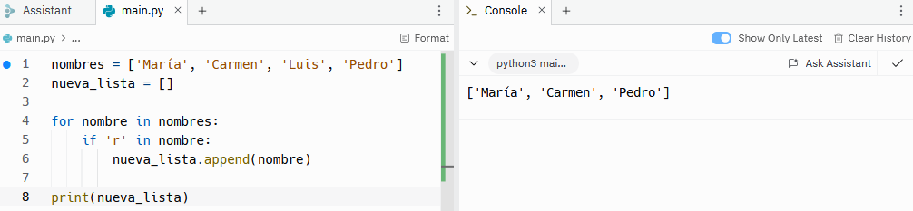
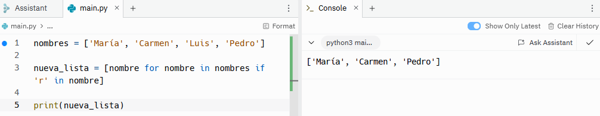

# Lista por comprensión

Las listas por comprensión son una forma de crear una nueva lista partiendo de los valores de una lista preexistente. Esto mismo podría realizarse utilizando los bucles normales, pero la diferencia es que las listas de comprensión ocupan una sola línea de código mientras que los bucles normales ocupan más espacio. 

Imaginemos que queremos una lista con todos los números del 1 al 10 multiplicados por 3. Partimos de una lista con los números del 1 al 10 y otra lista nueva vacía que contendrá los números multiplicados por 3.
```sh
numeros = range(1, 11)
nueva_lista = []

for numero in numeros:
    nueva_lista.append(numero * 3)

print(nueva_lista)
```


Ese es el bucle normal, pero lo mismo que está escrito en el ejemplo anterior se puede escribir de la siguiente manera con una lista por comprensión.
```sh
numeros = range(1, 11)

nueva_lista = [numero * 3 for numero in numeros]

print(nueva_lista)
```


Como se puede observar ambos resultados son el mismo. La forma en la que se escribe una lista por comprensión es la siguiente. En primer lugar hay que crear una variable en la que queramos guardar la nueva lista, que en este caso es ```nueva_lista```. Luego entre corchetes se añade primero el cambio que queremos realizar con respecto a la lista original, en este caso multiplicar todos los números por 3 ```num * 3```, y luego el bucle con la lista preexistente que queremos utilizar ```for numero in numeros```.

Las listas por comprensión también pueden contener condicionales. Vamos a ver un ejemplo:
```sh
nombres = ['María', 'Carmen', 'Luis', 'Pedro']
nueva_lista = []

for nombre in nombres:
    if 'r' in nombre:
        nueva_lista.append(nombre)

print(nueva_lista)
```


Esta sería la forma normal de crear la nueva variable.
```sh
nombres = ['María', 'Carmen', 'Luis', 'Pedro']

nueva_lista = [nombre for nombre in nombres if 'r' in nombre]

print(nueva_lista)
```


Y esta la lista por comprensión. Como se puede observar, en el caso de haber una condición, se añade al final de la lista.