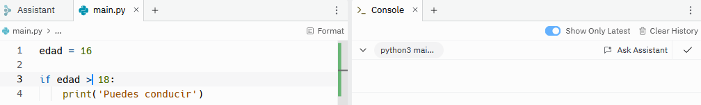
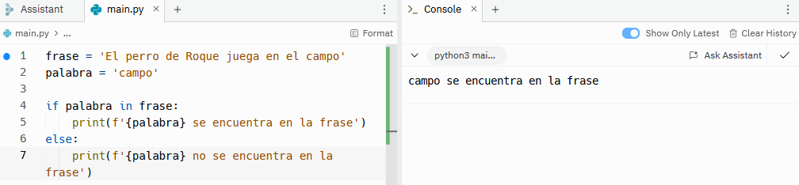
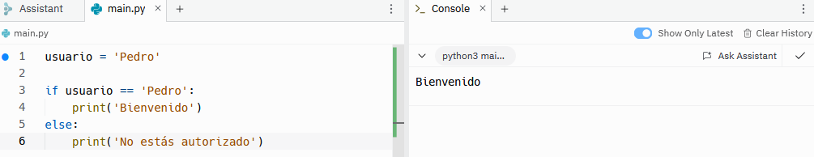
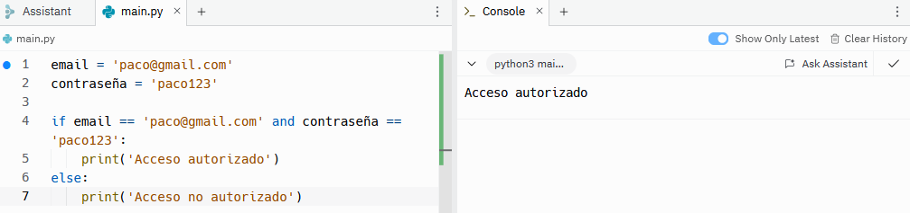
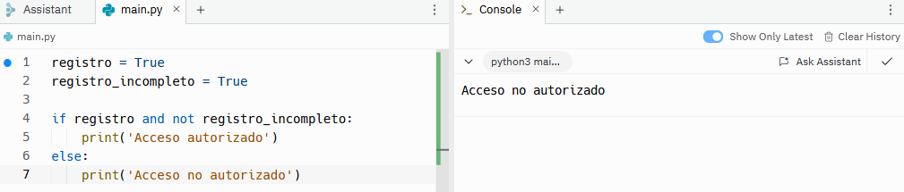

# Declaraciones condicionales
Las declaraciones condicionales permiten ejecutar el código si se cumplen una serie de requisitos o condiciones. Este tipo de declaraciones permiten realizar un programa dinámico y que tome decisiones en función de la situación. La forma en la que se escribe una declaración condicional es mediante la palabra clave ```if```, y hay que prestar especial atención a la sangría, ya que, de lo contrario, daría lugar a errores. Empezaremos con un ejemplo sencillo:
```sh
edad = 40

if edad > 18:
    print('Puedes conducir')
```
Como se observa en el ejemplo, la forma de escribir una declaración condicional es escribiendo ```if``` seguido de la condición y ```:```. En la siguiente línea, antes de escribir el resultado que queremos que nos devuelva, es necesario dejar 4 espacios (sangría). 
El resultado del código anterior es el siguiente:


Como la edad es de 40 años, el resultado es 'Puedes votar'. 
Si la edad fuera 16, no da ningún resultado porque no hay ninguna ninguna orden que recoja la condición edad < 16.
```sh
edad = 16

if edad > 18:
    print('Puedes conducir')
```


Para ello hay otras palabras clave que son ```elif``` y ```else```. ```elif``` permite añadir más de una condición, es decir, si la primera condición no se cumple pasa a comprobar si la segunda se cumple. Mientras que ```else``` incluye todas las situaciones que no se incluyan en las condiciones anteriores. 
```sh
edad = 40

if edad < 18:
    print('No puedes conducir')
elif edad > 90:
    print('No puedes conducir')
else:
    print('Puedes conducir')
```
En este caso, siendo la edad es 40, el resultado será 'Puedes conducir', mientras que si la edad es 16 o 92, por ejemplo, el resultado será 'No puedes conducir'.


## Operadores condicionales
Además de los operadores utilizados hasta ahora, que son > y <, hay otros 5. A continuación se muestra una lista completa con todos los operadores que se pueden utilizar en las declaraciones condicionales.
- Igualdad: ==
- Mayor que: >
- Mayor o igual que: >=
- Menor que: <
- Menor o igual que: <=
- Diferencia: !=
- Diferencia: <>

La última forma de expresar diferencia no se utiliza, de hecho, está obsoleta. 

Por otro lado, hasta ahora hemos utilizado las condicionales con números. A continuación, veremos algunos ejemplos que combinan los diferentes operadores con diferentes estructuras de datos.

### Cadenas:
```sh
usuario = 'Pedro'

if usuario == 'Pedro':
    print('Bienvenido')
else:
    print('No estás autorizado')
```


### Números:
```sh
edad = 18

if edad >= 18:
    print('Puedes votar')
else:
    print('No puedes votar')
```


### Listas o tuplas:
```sh
lista_uno = ['Pedro', 'Juan']
lista_dos = ['María', 'Carmen']

if lista_uno != lista_dos:
    print('No coinciden')
else:
    print('Coinciden')
```


### Operador in
Además de los operadores vistos hasta ahora, existe otro operador, ```in```, que se utiliza para buscar elementos dentro de estructuras de datos. En este caso utilizaremos una cadena.
```sh
frase = 'El perro de Roque juega en el campo'
palabra = 'campo'

if palabra in frase:
    print(f'{palabra} se encuentra en la frase')
else:
    print(f'{palabra} no se encuentra en la frase')
```
Tratamos de buscar la palabra 'campo' en la frase y, como coincide, obtenemos 'campo se encuentra en la frase'.



## Operador ternario
Existe otra forma de escribir las declaraciones condicionales que se recomienda utilizar en el caso de declaraciones sencillas. Este operador ternario permite escribir la condición en una sola línea de código, por lo que permite ahorrar líneas de código. El código siguiente:
```sh
usuario = 'Pedro'

if usuario == 'Pedro':
    print('Bienvenido')
else:
    print('No estás autorizado')
```


Dará el mismo resultado escrito de la siguiente forma:
```sh
print('Bienvenido') if usuario == 'Pedro' else print('No estás autorizado')
```


## Condicionales compuestas
Hasta ahora hemos visto condicionales simples con la siguiente estructura: si se cumple 'condición 1' --> 'resultado 1', si se cumple 'condición 2' --> 'resultado 2' y, si no se cumple ningúna de las anteriores --> 'resultado 3'. Sin embargo, le podemos decir al programa que si se cumplen 'condición 1' y 'condición 2' queremos 'resultado 1'. Es decir, las condicionales compuestas contienen varias condiciones en una sola línea de código. En estas condicionales se utilizan 3 tipos de operadores, que son ```and```, ```or``` y ```and not```. 
Para los siguientes ejemplos vamos a simular que estamos creando un sistema de inicio de sesión en una aplicación. En estos casos solo se permite el acceso a la cuenta cuando el email y la contraseña son correctos, por lo que utilizaremos el operador ```and```.
```sh
email = 'paco@gmail.com'
contraseña = 'paco123'

if email == 'paco@gmail.com' and contraseña == 'paco123':
    print('Acceso autorizado')
else:
    print('Acceso no autorizado')
```


Si el email y la contraseña coinciden, tendremos acceso a la cuenta, mientras que si no coinciden no podremos entrar.

Ahora imaginemos un sistema de inicio de sesión que permite acceder a nuestra cuenta utilizando el nombre de usuario o el email. En este caso utilizaremos el operador ```or```.
```sh
email = 'paco@gmail.com'
usuario = 'margarita'

if email == 'paco@gmail.com' or usuario == 'paco':
    print('Acceso autorizado')
else:
    print('Acceso no autorizado')
```


Podemos observar que nos da acceso porque, aunque el usuario no sea paco, el email coincide.

Para el ejemplo con el operador ```and not``` vamos a imaginar que para tener acceso a la aplicaión es necesario registrarse y completar el registro. En este caso si el registro se cumple pero no está completo, el cliente no tendrá acceso a la aplicación. 
```sh
registro = True
registro_incompleto = True

if registro and not registro_incompleto:
    print('Acceso autorizado')
else:
    print('Acceso no autorizado')
```


Como el registro está realizado pero no está completo, el cliente no tendrá acceso a la aplicación.

Finalmente, veremos un ejemplo en el que se combinan varios operadores. En este caso, queremos un sistema que admita nombre de usuario o email, y contraseña.
```sh
email = 'paco@gmail.com'
usuario = 'margarita'
contraseña = 'paco123'

if (email == 'paco@gmail.com' or usuario == 'paco') and contraseña == 'paco123':
    print('Acceso autorizado')
else:
    print('Acceso no autorizado')
```


Aunque el nombre de usuario no sea correcto, como el email está bien y la contraseña también, el cliente tendrá acceso a la aplicación.


