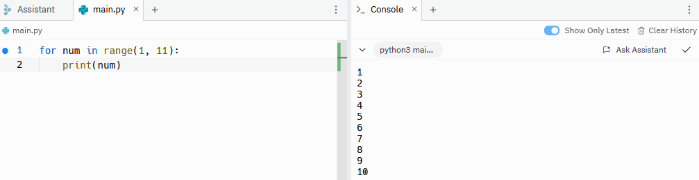
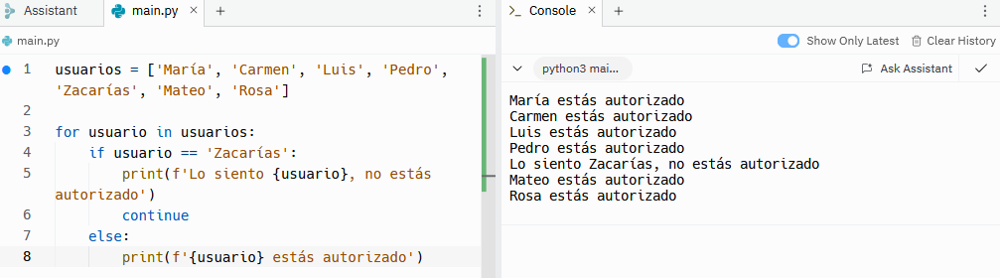
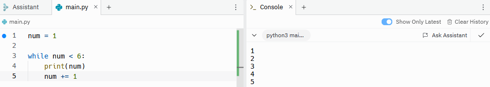

# Tipos de bucles

Los bucles permiten repetir todos los elementos de una lista, tupla, diccionario, set o cadena. Hay dos tipos de bucles:
- For-in: repite el bucle tantas veces como elementos haya en la estructura de datos. Es decir, pasa por todos los elementos de la lista una única vez y termina cuando se acaban los elementos. 
- While: repite el bucle infinitas veces si no tiene un valor centinela. El valor centinela es el que le dice al bucle cuándo tiene que parar. 

## Bucle for-in
La forma de escribir un bucle for in es la siguiente:
```sh
nombres = ['María', 'Carmen', 'Luis', 'Pedro']

for nombre in nombres:
    print(nombre)
```


Al igual que con las declaraciones condicionales hay que prestar especial atención a la sangría ya que, de lo contrario, dará lugar a errores. Además, por convenio, en la primera parte del bucle se utiliza la misma palabra que en la segunda parte pero en singular. En este caso como la variable se llama ```nombres``` la primera parte del bucle es ```nombre```. Como se puede observar el resultado son todos los nombres de la lista.

Los bucles también se pueden utilizar con cadenas:
```sh
cadena = 'perro'

for letra in cadena:
    print(letra)
```


Y con diccionarios:
```sh
usuarios = {
    'Pedro': 12,
    'María': 35,
    'Juan': 23
}

for usuario, edad in usuarios.items():
    print('Nombre:', usuario)
    print('Edad:', edad)
```


Además de utilizar listas, tuplas, cadenas, etc. también se pueden utilizar rangos numéricos.
```sh
for num in range(1, 11):
    print(num)
```


### Break vs. continue
Como ya hemos comentado en los bucles for-in se repite el bucle tantas veces como elementos haya en la estructura. Sin embargo, es posible que queramos parar el bucle antes o queramos que el bucle continúe a pesar de que ya hayamos encontrado el resultado que queríamos. Para ellos existen las declaraciones ```continue``` y ```break```.
Imaginemos que tenemos una lista de nombres y queremos buscar un nombre determinado. También queremos que una vez ha encontrado el nombre termine el bucle.
```sh
nombres = ['María', 'Carmen', 'Luis', 'Pedro', 'Zacarías', 'Mateo', 'Rosa']

for nombre in nombres:
    if nombre == 'Pedro':
        print(f'{nombre} encontrado')
        break
    print(nombre)
```


Sin embargo, si estamos mirando una lista de usuarios y queremos buscar los que no están registrados en nuestra aplicación, tendremos que mirar la lista completa aunque ya hayamos encontrado un usuario no registrado.
```sh
usuarios = ['María', 'Carmen', 'Luis', 'Pedro', 'Zacarías', 'Mateo', 'Rosa']

for usuario in usuarios:
    if usuario == 'Zacarías':
        print(f'Lo siento {usuario}, no estás autorizado')
        continue
    else:
        print(f'{usuario} estás autorizado)
```


## Bucle while
En los bucles while es necesario un valor centinela que le diga al bucle cuando parar ya que, de lo contrario, el bucle será infinito. En el siguiente ejemplo el valor centinela es el 6, es decir, mientras que el número sea menor que 6 cada vez que el bucle se repita sumara 1 al número inicial. Cuando llegue al 6 el bucle se terminará.
```sh
num = 1

while num < 6:
    print(num)
    num += 1
```



